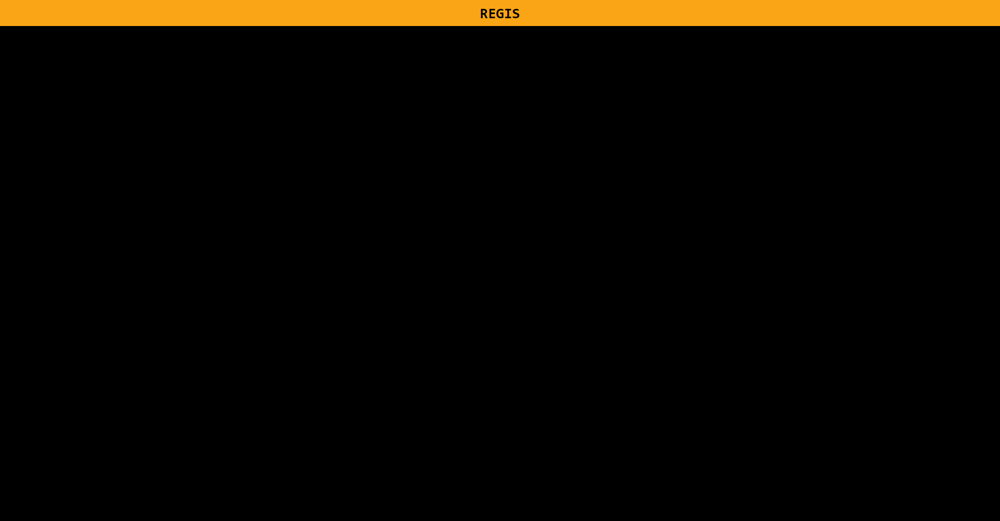
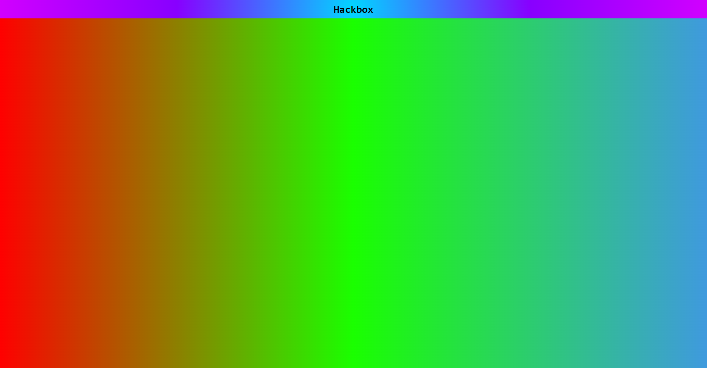

# Theme
A theme describes the basic theming of a member's screen. It can define the default background colors and text colors of the Header and Main sections of the, and is probably the first thing you should think about when creating a Hackbox state.
Here is an example of a theme object:

```typescript
{
    "version": 2,
    "theme": {
        // style for the window header
        "header": {
            // This defines the text colour
            "color": "black",

            // and this is the background colour. This can be any valid CSS, such as gradients, images, colours and more.
            "background": "#FAA516"
        },

        // styling for the main section
        "main": {
            // This is the background colour. This can be any valid CSS, such as gradients, images, colours and more.
            "background": "black"
        }
    },
}
```

This will result in something like this:



And an example of using CSS:

```typescript
{
    "version": 2,
    "theme": {
        "header": {
            "color": "black",
            "background": "radial-gradient(circle, rgba(0,215,255,1) 0%, rgba(136,0,255,1) 50%, rgba(209,0,255,1) 100%)",
            "fontFamily": "monospace"
        },
        "main": {
            "background": "linear-gradient(90deg, rgba(255,0,0,1) 0%, rgba(26,255,0,1) 50%, rgba(63,154,222,1) 100%)"
        }
    }
}
```

